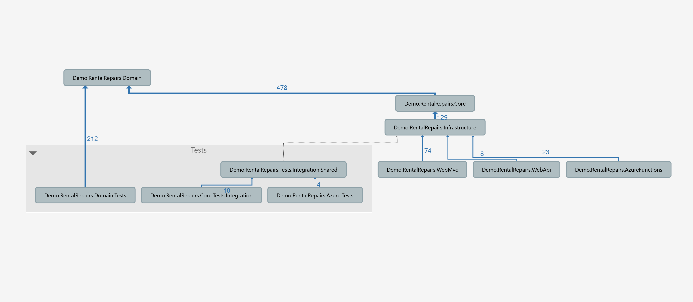

# DemoRentalRepairsWebAPI

The goal of this project was to build a simple workflow-based application with Domain Driven Design, Clean Architecture (Onion Architecture) and .NET Core technologies as well as  to demonstrate how the core components can be re-used in various configurations 

Domain Model:

The domain model contains DDD artifacts and domain-level validations built with the Fluent Validation library.

Core Services:

Provide application services abstracted from a specific implementation. For example, each workflow change can be initiated by an authorized user and also be stored in some repository

Infrastructure :

Provides implementation for core interfaces. For example, there are few implementations for the repository interface :In-Memory for testing,  Enitiy Framework Core, Mongo DB, Azure Cosmos DB.

ASP.NET Core MVC application:

Simple client that allows users to register, login and interact with core services through the UI

ASP.NET Web API:

Utilizes the same core services for mobile or any other client HTTP calls

Azure Functions:

Provide micro-services for building and sending the workflow emails 

